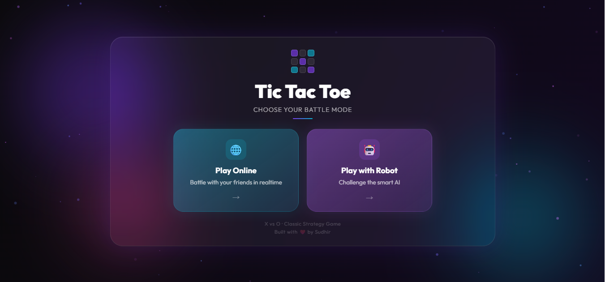
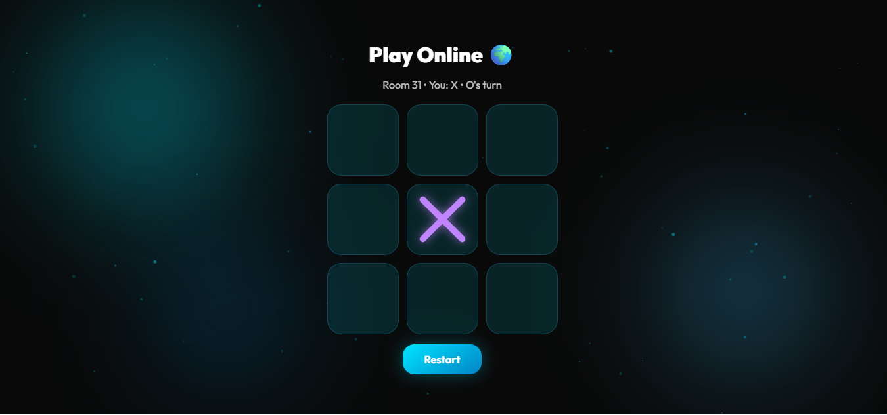
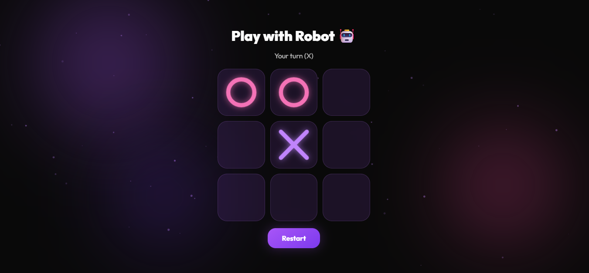

# ❌⭕ Tic Tac Toe Multiplayer

A real-time multiplayer Tic Tac Toe game built with HTML, CSS, JavaScript, and Firebase. Challenge your friends online, create or join game rooms, and enjoy a smooth gaming experience from any device.

## 🚀 Live Demo

🔗 https://tik-tak-toe-online-project.vercel.app/

---

## ✨ Features

- 🎮 Real-time multiplayer gameplay
- 🌐 Create and join game rooms
- ⚡ Instant move synchronization using Firebase
- 📱 Responsive design for desktop and mobile
- 🏆 Automatic win and draw detection
- 🔄 Play Again option
- 🎨 Modern and clean user interface
- ☁️ Deployed on Vercel

---

## 📷 Preview

<p align="center">
  
</p>

<p align="center">
  
</p>
<p align="center">
  
</p>
<p align="center">
  
</p>

> Replace these images with your own screenshots.

---

## 🛠️ Tech Stack

- HTML5
- CSS3
- JavaScript (ES6)
- Firebase Realtime Database
- Firebase Hosting (Backend)
- Vercel

---

## 📂 Project Structure

```text
tic-tac-toe-multiplayer/
│
├── css/
├── js/
├── images/
├── index.html
├── firebase.js
├── README.md
└── assets/
```

---

## ⚙️ Installation

Clone the repository

```bash
git clone https://github.com/Spidy-Sudhir/tic-tac-toe-multiplayer.git
```

Go into the project directory

```bash
cd tic-tac-toe-multiplayer
```

Open `index.html` in your browser or use Live Server.

---

## 🎮 How to Play

1. Open the game.
2. Create a new room or join an existing one.
3. Share the room code with your friend.
4. Wait for both players to connect.
5. Take turns placing X and O.
6. The game automatically detects the winner or a draw.
7. Click **Play Again** to start a new match.

---

## 💡 Future Improvements

- Voice chat
- Online matchmaking
- Game history
- Player profiles
- Global leaderboard
- Dark/Light mode
- Sound effects and animations

---

## 🤝 Contributing

Contributions are welcome!

1. Fork this repository
2. Create a new branch
3. Commit your changes
4. Push the branch
5. Open a Pull Request

---

## 📄 License

This project is licensed under the MIT License.

---

## 👨‍💻 Author

**Sudhir Kumar Gupta**

- GitHub: https://github.com/Spidy-Sudhir
- LinkedIn: https://www.linkedin.com/in/spidy-sudhir/

---

⭐ If you enjoyed this project, consider giving it a **Star**!
